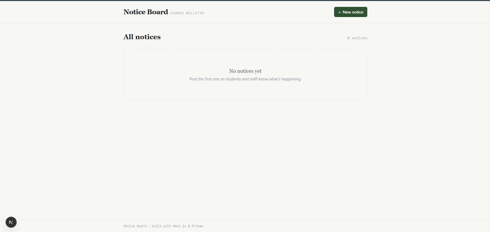
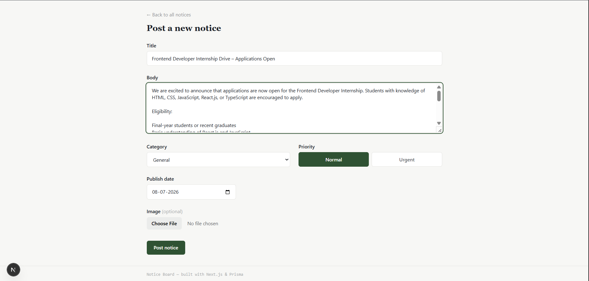
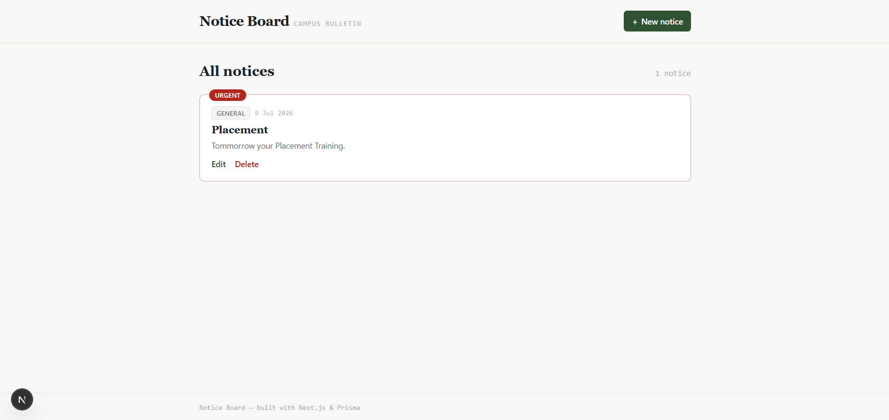

# Notice Board

A full CRUD notice board — built with **Next.js (Pages Router)**, **Prisma**, and a hosted MySQL database, deployed on **Vercel**.

Live app: _add your Vercel URL here after deploying_

## Features

- List all notices as responsive cards (phone + desktop).
- Create / edit a notice through one shared form.
- Delete a notice, with a confirmation dialog first.
- Fields: title, body, category (`Exam` / `Event` / `General`), priority (`Normal` / `Urgent`), publish date, and an optional image.
- **Urgent-first ordering is done in the database query** (Prisma `orderBy`), not by sorting an array in the browser — see `orderBy: [{ priority: 'desc' }, { publishDate: 'desc' }]` in `pages/api/notices/index.js` and `pages/index.js`.
- All input validation (required fields, valid date, valid enum values, image size/type) runs **server-side** inside the API routes (`lib/validateNotice.js`), not just in the browser.


## 📸 Screenshots

### Home Page



### Create Notice



### Notice List




## Tech stack

| Layer      | Choice                                   |
|------------|-------------------------------------------|
| Framework  | Next.js 14, **Pages Router** (`pages/`)   |
| Database   | Prisma ORM, MySQL (TiDB Cloud, free tier) |
| Hosting    | Vercel (Hobby/free tier)                  |
| Styling    | Tailwind CSS                              |

## 1. Running the project locally

**Requirements:** Node.js 18+ and a free hosted MySQL database (see step 2 below for how to get one in 5 minutes).

```bash
# 1. Install dependencies
npm install

# 2. Copy the env file and add your database connection string
cp .env.example .env
# then edit .env and paste your DATABASE_URL

# 3. Push the schema to your database (creates the Notice table)
npx prisma db push

# 4. Run the dev server
npm run dev
```

Open http://localhost:3000 — you should see an empty notice board. Click **+ New notice** to create your first one.

## 2. Setting up a free hosted database (TiDB Cloud)

You need this **before** step 1 above works, since there's no local database in this project (a local SQLite file won't survive on Vercel — its filesystem resets on every request).

1. Go to https://tidbcloud.com and sign up for a free account (no credit card needed for the Serverless tier).
2. Create a new **Serverless** cluster (free tier). Pick any region close to you.
3. Once it's created, open the cluster → **Connect**.
4. Choose "Prisma" (or "General") as the connection type, and copy the generated connection string. It looks like:
   ```
   mysql://<user>:<password>@<host>:4000/<database>?sslaccept=strict
   ```
5. Paste that as `DATABASE_URL` in your `.env` file.

(Neon or Supabase — both Postgres — also work. If you use one of those instead, just change `provider = "mysql"` to `provider = "postgresql"` in `prisma/schema.prisma`, and use their connection string format instead.)

## 3. Pushing the code to GitHub

```bash
git init
git add .
git commit -m "Initial commit: Notice Board CRUD app"
```

Then on https://github.com, create a **new public repository** (no README/gitignore, since you already have them), and push:

```bash
git remote add origin https://github.com/<your-username>/<your-repo-name>.git
git branch -M main
git push -u origin main
```

Make a few real commits as you build/tweak (not just one "initial commit") — e.g. commit after the schema, after the API routes, after the UI — so there's a genuine commit history.

## 4. Deploying to Vercel

1. Go to https://vercel.com and sign up (you can sign in with your GitHub account directly — no credit card needed for the Hobby tier).
2. Click **Add New → Project**, and import the GitHub repository you just pushed.
3. Before deploying, open **Environment Variables** and add:
   - `DATABASE_URL` → the same connection string from your `.env` file.
4. Click **Deploy**. Vercel will run `npm install`, then `prisma generate && next build` (already wired up as the `build` script in `package.json`).
5. Once deployed, open the given `*.vercel.app` URL and confirm it opens without logging in and the notice board works end to end (create, edit, delete, refresh).

If the database table doesn't exist yet on the hosted DB, run `npx prisma db push` once locally (pointed at the same `DATABASE_URL` you gave Vercel) before or after the first deploy — this creates the `Notice` table.

## 5. One thing I'd improve with more time

Right now, notice images are stored as base64 strings directly in the database (`LongText` column). This is the simplest approach that works within a free-tier stack with no extra paid services, but it isn't ideal for larger images or a large volume of notices — it bloats the database and every page load pulls the full image data. With more time, I'd move image storage to a dedicated object store (e.g. Vercel Blob or Cloudflare R2, both of which have free tiers) and store only the resulting URL in the database.

## 6. Where and how AI was used

AI (Claude) was used to help scaffold the project structure, write the Prisma schema, API routes, and React components, and to draft this README. All AI-generated code was reviewed, and the app was built and its build output checked before submission. The Urgent-first ordering logic, server-side validation rules, and overall requirements were driven directly by the assignment spec.
